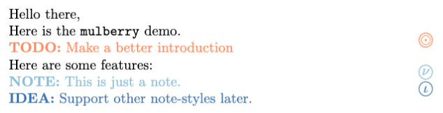

# 🟣 `mulberry` ~ notes, todo's and other in-line comments for LaTeX

> [!NOTE]
> Mark your **TODO's and other notes** in the LaTeX document, with a subjective style and margin highlights.

This package allows a specific way of note-taking in LaTeX documents.   
It uses inline comments, simple style, and visual clues in margins. 

> [!TIP]
> 


## Getting started

> [!WARNING]
> `mulberry` is not yet published on CTAN repository.  
> Use the [manual approach](#manual-approach) below to use it for now:

### Manual approach

1. Copy the `mulberry.sty` into your LaTeX project's root.
2. Important the package and use it in your LaTeX code:

    ```tex
    % Enable the marks
    \usepackage{mulberry}
    
    % This will hide all the marks, useful for final manuscript views
    % \usepackage[hidden]{mulberry-notes}
    
    \begin{document}
    
    Hello there,
    
    Here is the \texttt{mulberry} demo.
    
    \todoM{Make a better introduction} 
    
    Here are some features:
    
    \noteM{This is just a note.}
    
    \ideaM{Support other note-styles later.}
    
    \end{document}
    ```

    <details><summary><i>Rendered view:</i></summary>
    
    > 

    </details>

## Extending

### Local copies 

Since the project is not yet distributed through CTAN, feel free to adapt the source code of the copied `mulberry.sty` in your project. 

### Shared features

If you would like to make specific features available by default, feel free to suggest a PR. 

## Inspiration

Thanks for inspiration to: 

- [`zebra-goodies`](https://github.com/xueruini/zebra-goodies)

